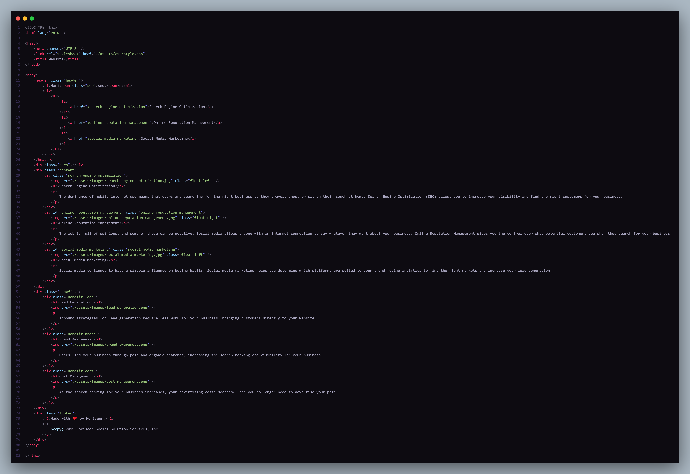
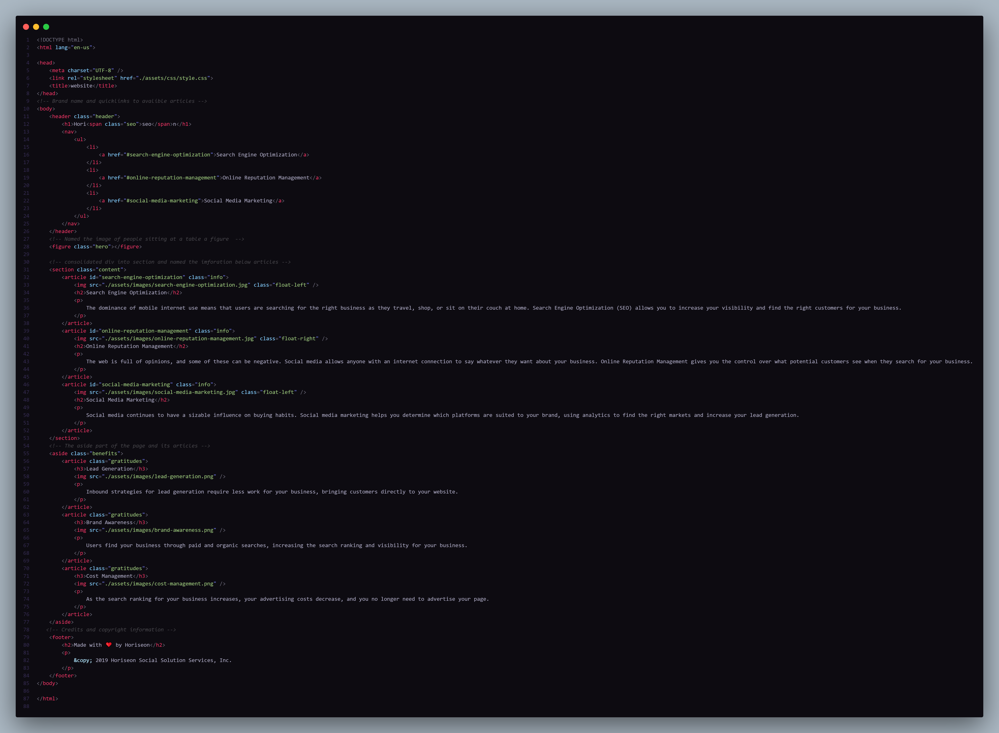
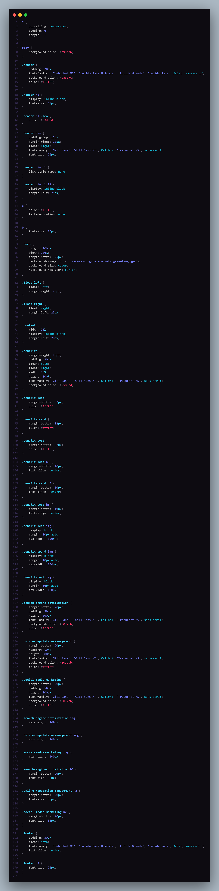
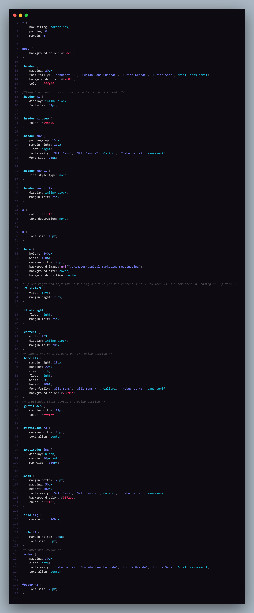

# code-refactor-biopsy

#Code-refactor-biopsy is the first homework assigment I was given in the BootCamp I am attending. The point of this assignment to take a given code with its assets and make it more semantic/cleaner to the users trying to read it. Once I did that I had to go in and de-bug it since the changes I made broke the page. 

#Code before it was given to me,

#GitHub pages link-->

